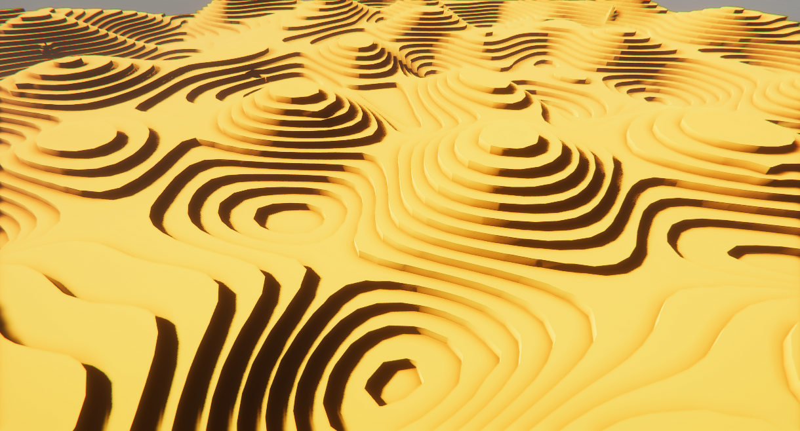

# Terraced Terrain HDRP

This project use my packages to create a procedural terraced terrain. The goal of this project it's first to test the performance of my packages that this project use and second to test Unity Burst, Jobs, and DOTS techonologies.

## Usage
This project use `Unity 2019.4.0f1`.

Just open the scene named `SampleScene` and press play.